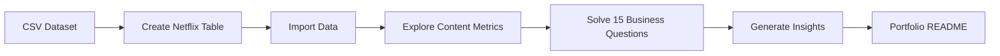

  <div align="center">
  

  <h1>🎬 Netflix SQL Business Analysis</h1>

  <p>
    <b>A professional SQL analytics project solving 15 business questions on Netflix titles, content trends, genres, actors, ratings, and country-level availability.</b>
  </p>

  

  <br/>

  
  
  
  
</div>

---

## 📌 Project Overview

This project analyzes the **Netflix Titles** dataset using SQL to answer practical business questions around content type, ratings, countries, genres, actors, directors, release trends, and content classification.

The analysis is designed as a portfolio-ready case study that demonstrates:

- 🧠 Business problem interpretation
- 🗃️ Relational schema design
- 🔍 SQL querying and data exploration
- 📊 Aggregation, ranking, filtering, and text analysis
- 🌍 Country and genre-level content segmentation
- 🧾 Clear reporting of insights for stakeholders

---

## 🚀 Key Metrics

| Metric | Value |
|---|---:|
| Total Netflix titles | **8,807** |
| Movies | **6,131** |
| TV Shows | **2,676** |
| Release year range | **1925 - 2021** |
| Dataset columns | **12** |
| Business questions solved | **15** |
| Missing director records | **2,634** |
| Missing date added records | **10** |
| TV shows with more than 5 seasons | **99** |
| Documentary titles | **869** |  
* The Dataset can be viewed here [CSV Dataset](Resources/netflix_titles.csv)
---

## 🧰 Tech Stack

| Tool | Purpose |
|---|---|
| **PostgreSQL** | SQL querying and analysis |
| **CSV Dataset** | Source data for Netflix titles |
| **SQL DDL** | Table creation and schema design |
| **CTEs & Window Functions** | Ranking and reusable query logic |
| **String Functions** | Splitting countries, genres, actors, and directors |

> PostgreSQL is recommended because the solution file uses functions such as `UNNEST`, `STRING_TO_ARRAY`, `TO_DATE`, `EXTRACT`, CTEs, and window ranking.

---

## 📁 Project Structure

```text
Netflix/
├── 📄 Business_Problems.sql             # List of 15 business questions
├── 📄 Business_Problem_Solutions.sql    # SQL solutions for each problem
├── 📄 Schemas.sql                       # Table schema definition
├── 📊 netflix_titles.csv                # Netflix titles dataset
├── 🖼️ logo.png                          # Netflix project logo
└── 📘 README.md                         # Project documentation
```

---

## 🧱 Database Schema

```sql
CREATE TABLE netflix
(
    show_id      VARCHAR(5),
    type         VARCHAR(10),
    title        VARCHAR(250),
    director     VARCHAR(550),
    casts        VARCHAR(1050),
    country      VARCHAR(550),
    date_added   VARCHAR(55),
    release_year INT,
    rating       VARCHAR(15),
    duration     VARCHAR(15),
    listed_in    VARCHAR(250),
    description  VARCHAR(550)
);
```

### ⚠️ Import Note

The CSV header uses `cast`, while the SQL schema uses `casts`. This is a good practice because `cast` can be confused with SQL casting syntax.

When importing, map the CSV column position into the `casts` column:

```sql
COPY netflix(show_id, type, title, director, casts, country, date_added, release_year, rating, duration, listed_in, description)
FROM '/path/to/netflix_titles.csv'
DELIMITER ','
CSV HEADER;
```

---

## ❓ Business Questions Solved

<details open>
<summary><b>View all 15 SQL business problems</b></summary>

1. Count the number of Movies vs TV Shows.
2. Find the most common rating for movies and TV shows.
3. List all movies released in a specific year, such as 2020.
4. Find the top 5 countries with the most content on Netflix.
5. Identify the longest movie.
6. Find content added in the last 5 years.
7. Find all movies and TV shows by director `Rajiv Chilaka`.
8. List all TV shows with more than 5 seasons.
9. Count the number of content items in each genre.
10. Find each year and the average number of Netflix content releases in India, returning the top 5 years.
11. List all movies that are documentaries.
12. Find all content without a director.
13. Find how many movies actor `Salman Khan` appeared last 15 years.
14. Find the top 10 actors who appeared in the highest number of movies produced in India.
15. Categorize content as `Bad` if the description contains `kill` or `violence`; otherwise categorize it as `Good`.

</details>

---

## 📊 Insight Snapshot

### Content Type Distribution

| Type | Titles | Share |
|---|---:|---:|
| Movie | **6,131** | **69.61%** |
| TV Show | **2,676** | **30.39%** |

### Top Ratings

| Rank | Rating | Titles |
|---:|---|---:|
| 1 | TV-MA | **3,207** |
| 2 | TV-14 | **2,160** |
| 3 | TV-PG | **863** |
| 4 | R | **799** |
| 5 | PG-13 | **490** |

### Top Countries by Content Availability

| Rank | Country | Titles |
|---:|---|---:|
| 1 | United States | **3,690** |
| 2 | India | **1,046** |
| 3 | United Kingdom | **806** |
| 4 | Canada | **445** |
| 5 | France | **393** |

### Top Genres

| Rank | Genre | Titles |
|---:|---|---:|
| 1 | International Movies | **2,752** |
| 2 | Dramas | **2,427** |
| 3 | Comedies | **1,674** |
| 4 | International TV Shows | **1,351** |
| 5 | Documentaries | **869** |

### Longest Movies

| Rank | Title | Duration | Release Year |
|---:|---|---:|---:|
| 1 | Black Mirror: Bandersnatch | 312 min | 2018 |
| 2 | Headspace: Unwind Your Mind | 273 min | 2021 |
| 3 | The School of Mischief | 253 min | 1973 |
| 4 | No Longer kids | 237 min | 1979 |
| 5 | Lock Your Girls In | 233 min | 1982 |  
* The solutions to all 15 problems can be viewed here [Problems' Solutions](Resources/Business_Problem_Solutions.sql) 

---

## 🧠 SQL Concepts Demonstrated

| Concept | Example Use Case |
|---|---|
| `GROUP BY` | Count movies vs TV shows, ratings, genres |
| CTEs | Build reusable rating ranking logic |
| `RANK()` | Find the most common rating by content type |
| `UNNEST()` | Split comma-separated countries, actors, genres, and directors |
| `STRING_TO_ARRAY()` | Normalize multi-value fields |
| `ILIKE` | Case-insensitive text search |
| `TO_DATE()` | Convert text dates into date values |
| `EXTRACT()` | Analyze content by year |
| `CASE` | Categorize descriptions into content labels |
| Subqueries | Identify longest movie and percentage calculations |

---

## 🔄 Analysis Workflow



---

## ⚡ How to Run This Project

### 1. Create the database table

```sql
\i Scehmas.sql
```

### 2. Import the dataset

```sql
COPY netflix(show_id, type, title, director, casts, country, date_added, release_year, rating, duration, listed_in, description)
FROM '/absolute/path/to/netflix_titles.csv'
DELIMITER ','
CSV HEADER;
```

### 3. Run the business queries

```sql
\i Business_Problem_Solutions.sql
```

---

## 🧪 Sample Query

Find the top 5 countries with the most Netflix content:

```sql
SELECT *
FROM
(
    SELECT
        UNNEST(STRING_TO_ARRAY(country, ',')) AS country,
        COUNT(*) AS total_content
    FROM netflix
    GROUP BY 1
) AS t1
WHERE country IS NOT NULL
ORDER BY total_content DESC
LIMIT 5;
```

---

## 🏷️ Content Classification Logic

The project includes a simple rule-based classification query:

| Label | Rule |
|---|---|
| `Bad Content` | Description contains `kill` or `violence` |
| `Good Content` | Description does not contain those keywords |

```sql
CASE
    WHEN description ILIKE '%kill%' OR description ILIKE '%violence%'
    THEN 'Bad Content'
    ELSE 'Good Content'
END AS category
```

---

## ✅ Project Highlights

- 🎯 Solves real business-style analytics questions.
- 📈 Includes content, rating, geography, actor, director, and genre analysis.
- 🧩 Demonstrates SQL techniques useful in analyst interviews.
- 🌐 Handles multi-value text fields such as countries, genres, casts, and directors.
- 🧾 Documents schema, workflow, import notes, metrics, and project structure.
- 🧠 Converts raw entertainment data into stakeholder-friendly insights.

---

## 📌 Recommended Improvements

- Add a cleaned staging table to normalize countries, genres, directors, and actors.
- Convert `date_added` from `VARCHAR` to `DATE` after import.
- Store movie duration and TV seasons as separate numeric fields.
- Add output screenshots or query result exports for selected business questions.
- Build a dashboard in Power BI, Tableau, or Streamlit using the SQL outputs.

---

# 🤝 Connect With Me  
## 👤 Author

**Rajay Jain**  
* **📧 Email**: jainrajay2001@gmail.com  
* **💼 LinkedIn**: [www.linkedin.com/in/rajay-ajay-jain-a3abb4168](https://www.linkedin.com/in/rajay-ajay-jain-a3abb4168)  
* **🐙 GitHub**: [https://github.com/RajayJain](https://github.com/RajayJain)  


Data Analytics Portfolio Project  
Focus: SQL • Business Analysis • Data Exploration • Netflix Content Insights

---

<div align="center">
  <h3>⭐ If this project helps you, consider starring the repository!</h3>
  
</div>

